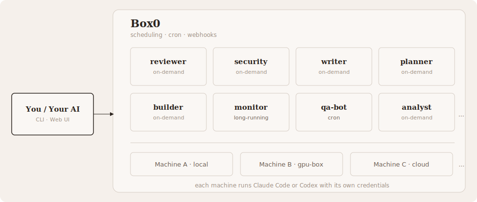

<p align="center">
  <picture>
    <source srcset=".github/box0-logo-dark.svg" width="400px" media="(prefers-color-scheme: dark)">
    
  </picture>
</p>

<div align="center">

__Open-Source Platform for Subagents and Agent Teams.__

[](https://go.risingwave.com/slack)
[](https://www.npmjs.com/package/@box0/cli)
[](LICENSE)
[](https://github.com/risingwavelabs/box0/tree/main/docs)
[](SKILL.md)

</div>

Box0 runs multiple AI agents in parallel. You create agents with different roles, trigger them on demand or on a schedule, and collect results. It works with Claude Code and Codex. Single Rust binary, no dependencies.

  - **Long-running**: agents that persist across sessions and never disappear
  - **Collaborative**: shared across team members
  - **Proactive**: cron schedules, webhooks, Slack notifications

<p align="center">
  
</p>

## Box0 vs Subagents

<div align="center">

|               | Box0                              | Subagents              |
|:-------------:|:---------------------------------:|:----------------------:|
| Setup         | `npm install`, one binary         | Built-in, zero config  |
| Persistence   | Agents and conversations persist  | Session only           |
| Scheduling    | Cron jobs                         | :x:                    |
| Notifications | Webhooks, Slack, and more         | :x:                    |
| Team sharing  | Workspaces, multi-user            | :x:                    |
| Dashboard     | Web UI                            | :x:                    |
| Runtime       | Any agent runtime                 | Claude Code only       |

</div>

## How it works

A **server** coordinates everything. It stores agent definitions, routes tasks, runs the scheduler, and serves a web dashboard. Start one with `b0 server` (runs in background).

**Workspaces** organize agents by team. Each user gets a personal workspace.

**Agents** do the actual work. Each agent has a name, a set of instructions, and a set of triggers. Three trigger types:

- **Manual** - trigger on demand with `b0 run <name> "<task>"`.
- **Cron** - run on a schedule. Set with `b0 add --every 1h --task "..."`.
- **Webhook** - triggered by HTTP POST. Enable with `b0 add --webhook`.

Your AI (Claude Code or Codex) creates agents with `b0 add`, runs tasks with `b0 run`, and can run multiple agents in parallel. You type one prompt. Your agent handles the rest.

## Agent onboarding

```bash
npx skills add risingwavelabs/skills --skill b0
```

Or read [SKILL.md](SKILL.md) directly.

Your agent creates workers with `b0 add` and sends tasks via `b0 run`. The server stores tasks in an inbox. A daemon polls the inbox, spawns a separate Claude Code (or Codex) process for each worker, and writes the results back. `b0 run` blocks until the result is ready.

Each worker runs in its own isolated directory.

Agent runs use a 30 minute default execution timeout. This prevents longer workflow steps from failing at the old 5 minute default on first run.
## Getting started

Install:

```bash
npm install -g @box0/cli@latest
```

Start the server:

```bash
b0 server
```

On first start, Box0 creates an admin account and prints your API key.

If you want a fixed admin credential for other services, configure it before first start:

```toml
# server.toml
admin_name = "service-admin"
admin_key = "b0_service_admin_key"
```

```bash
b0 server --config server.toml
```

You can also use `B0_ADMIN_NAME` and `B0_ADMIN_KEY`. These settings are applied when Box0 bootstraps the initial admin for a new database.

If the server has already been started before, create or update a dedicated admin user explicitly:

```bash
b0 admin ensure --db ~/.b0/b0.db --name service-admin --key b0_service_admin_key
```

This command runs locally against the Box0 database. It can create a separate admin user for integrations without replacing your existing admin account.

### Frontend development

The server now prefers `frontend/dist` when it exists, and falls back to the legacy `web/` dashboard otherwise.

For day-to-day frontend development, run Vite separately:

```bash
cd frontend
pnpm install
pnpm dev
```

Vite proxies `/workspaces`, `/machines`, and `/users` to `http://127.0.0.1:8080` by default. To point it at a different backend, set `B0_FRONTEND_BACKEND_URL`.

To let the Rust server serve the Vue app directly, build the frontend first:

```bash
cd frontend
pnpm build
```

### 3. Teach your agent to use Box0

Teach your agent to use Box0 ([how skills work](docs/skills.md)):

```bash
npx skills add risingwavelabs/skills --skill b0
```

Then open Claude Code or Codex and say:

> Create three agents: an optimist, a pessimist, and a realist. Ask them to debate whether AI will replace software engineers in 5 years. Give me your own conclusion.

## Features

**Parallel execution.** Run multiple agents at once.

```bash
b0 run reviewer "Review this PR for correctness." &
b0 run security "Review this PR for vulnerabilities." &
wait
```

**Cron schedules.** Schedule recurring tasks.

```bash
b0 add monitor --instructions "Check production logs for errors." --every 6h --task "scan logs"
```

**Webhook triggers.** Trigger agents via HTTP POST.

```bash
b0 add notifier --instructions "Process alerts." --webhook
b0 info notifier
```

**Slack notifications.** Get notified when agents finish.

```bash
b0 add alerter --instructions "Triage alerts." --slack "#ops"
```

See [Slack setup](docs/slack.md) for configuration.

**Pipe content.** Pass files and diffs directly.

```bash
git diff | b0 run reviewer "Review this diff."
```

**Web dashboard.** Manage agents and view tasks at `http://localhost:8080`.

## CLI reference

```
b0 server                                              Start server (background)
b0 server stop                                         Stop server
b0 server status                                       Show server status
b0 admin ensure --name <name> --key <key>              Create/update a local admin user
```

```
b0 add <name> --instructions "..."                     Create agent
b0 add <name> --instructions "..." --every 1h --task "..." Create scheduled agent
b0 add <name> --instructions "..." --webhook           Create agent with trigger URL
b0 add <name> --instructions "..." --webhook-secret s  Create agent with HMAC secret
b0 ls                                                  List agents
b0 info <name>                                         View agent details and trigger URL
b0 logs <name>                                         View recent task history
b0 update <name> --instructions "..."                  Update agent instructions
b0 rm <name>                                           Delete agent
```

```
b0 run <agent> "<task>"                                Trigger agent and wait for result
b0 run <agent> "<task>" --timeout 600                  Trigger with custom timeout (seconds)
```

## Learn more

- [Skills](docs/skills.md) - how skills teach your agent to use Box0
- [Cron jobs](docs/cron.md) - schedule recurring tasks
- [Slack notifications](docs/slack.md) - get notified when agents finish
- [Workspaces](docs/teams.md) - share a Box0 server with multiple users
- [Architecture](docs/architecture.md) - task flow, data model, and diagrams
- [CLI reference](docs/cli.md) - full command reference
- [Workflows](docs/workflows.md) - agent-first DAG workflow design for Box0

## Web dashboard

Open your browser to the server URL (default `http://localhost:8080`) and log in with your API key. Manage workers, view tasks, monitor nodes, and manage your team from the UI.

## License

MIT License. Copyright (c) 2026 RisingWave Labs.
